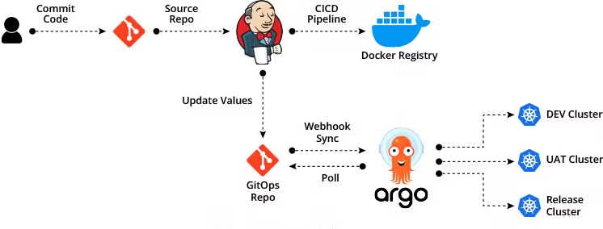

Distributed Customer Feedback Application
=========

Overview
---------------
Distributed microservice applications are becoming the premier architecture in the software and I.T industry due to their scalability, high availablity, and versatility. Microservice architecture allows applications to scale independently of each other as well as fail independently of each other. In addition, developers can build microservices independently of other teams and build their microservices how they choose. This customer feedback application is a perfect example of this. The frontend apps are written with JavaScript and Python, and the backend controllers are written in Java and NodeJS. Redis provides a caching layer for collecting incoming customer feedback. Last but not least, the PostgreSQL database resides in a container just like the rest of the microservices.

In order to add actionable insights for businesses, I included a service that automatically facilitates customer representative response to negative customer reviews. This service is hosted mainly using AWS Eventbridge along with a third party API integration for Zendesk. When a customer leaves negative feedback, the service issues an event to Eventbridge, which then formats the event and sends the data to Zendesk, creating a brand new, actionable ticket for customer service reps. 

Each microservice, as mentioned, exists independently of the others, living inside their containers. To orchestrate and manage multiple containers, I used Kubernetes on top of AWS EKS. You'll find the Terraform code for starting up the EKS cluster in this repo. You will also find the application code, their Dockerfiles, and also Jenkins build automation code for automated code integration and deployment into your EKS cluster. 

Getting started
---------------
Download and install Terraform (https://developer.hashicorp.com/terraform/install). Installation should be relatively painless with a package manager like Homebrew for Mac or Chocolatey for Windows. Once installed, you can build the required Kubernetes infrastructure in AWS using the files in the Terraform folder.

Download and install Jenkins on an Amazon EC2 virtual machine: https://www.jenkins.io/doc/tutorials/tutorial-for-installing-jenkins-on-AWS/. Make sure that Docker is installed on this VM: https://stackoverflow.com/questions/76194079/how-to-install-docker-on-amazon-linux-2023. 

Once Docker is installed, run this command on your Jenkins VM: `sudo chmod 666 /var/run/docker.sock`

Download and install ArgoCD into your Kubernetes cluster: https://argo-cd.readthedocs.io/en/stable/getting_started/

You will use Jenkins as well as ArgoCD to deploy new code, build that code, and finally deploy that code to the cluster. Feel free to take a look at the GitOps pipeline below for a better understanding of how the code is built in Jenkins, deployed to Dockerhub, and then pushed back as a Docker image into the Kubernetes manifest files.

Jenkins
-----
Once Jenkins has been installed on your Jenkins virtual machine, go ahead and build a new pipeline job for each microservice. Each microservice will have its own Jenkins pipeline and Jenkinsfile, which you can find in each microservices' respective folder. 

ArgoCD
-----
ArgoCD automatically pulls configurations from Kubernetes manifest files into your cluster. As long as ArgoCD is installed in your cluster and has access to your .yaml config files, ArgoCD will pull your applications into your cluster and attempt to start them. I've stored all the config files in /deploy. Make sure your ArgoCD client follows the path to this folder. 

Architecture
-----

* A Python webapp which lets you select between good or bad service
* A Redis queue which collects new feedback
* A .NET worker which consumes feedback and stores it...
* A Postgres database backed by a Docker volume
* A Node.js webapp which shows the results of the feedback in real time

GitOps Pipeline
-----

Note
----

This application only accepts one submission per client. It does not register 2nd and 3rd submissions if a first submission has already been submitted from a client.
